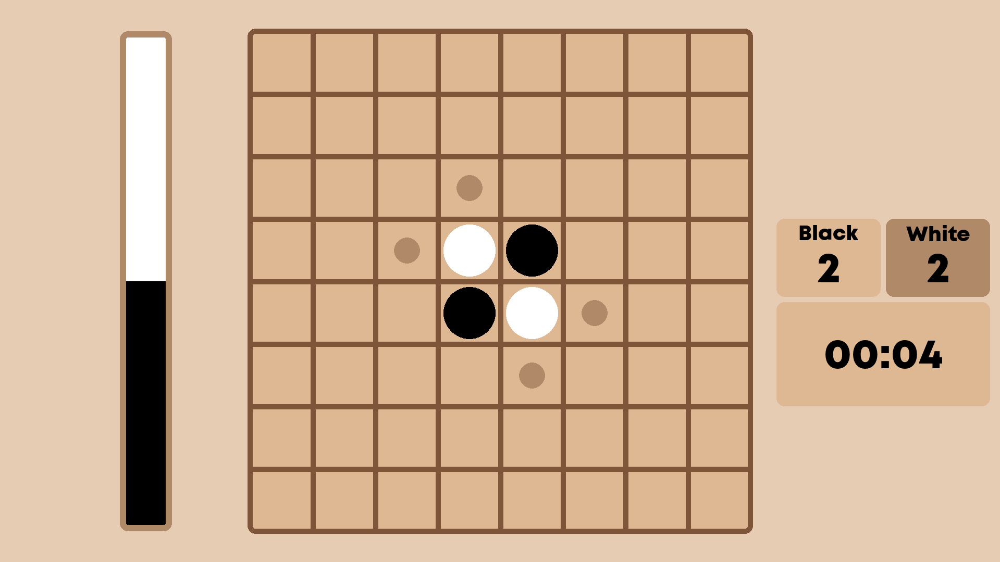

# Reversi

A [Reversi](https://en.wikipedia.org/wiki/Reversi) implementation (specifically the "Othello" variant of it) in Python using PyGame.

## About
This was a school group project and I decided to publish it here since it turned out pretty well.
I think my teammates did a great job with the PyGame UI in particular.

My main responsibility was to create the bot you play the game against.

### Launching
Tested Python version is `3.12`. To launch the application run

`python -m reversi`

inside the project directory. It should automatically download needed dependencies
and create optimized bot code, if you have tools to compile C/C++ code on your machine.

### Bot Info

The bot uses [Monte Carlo Tree Search](https://en.wikipedia.org/wiki/Monte_Carlo_tree_search) to search for moves.
The first implementation was in raw Python, but that was pretty slow (as one might expect from it),
so a second implementation in [Cython](https://cython.org/) (which compiles its code into C) was created.

Code for the bot can be found in `reversi/bot/pure_python` and `reversi/bot/optimized` respectively.

